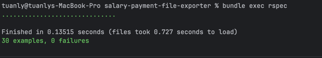
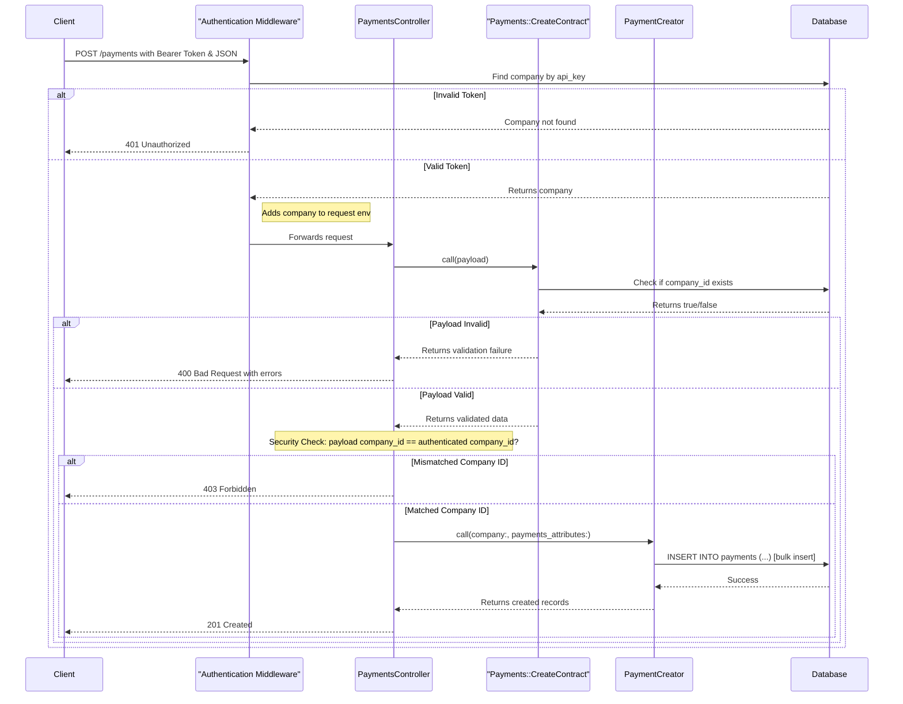
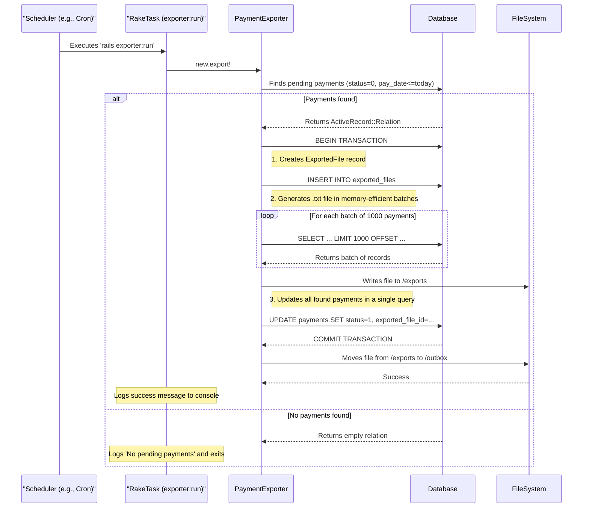
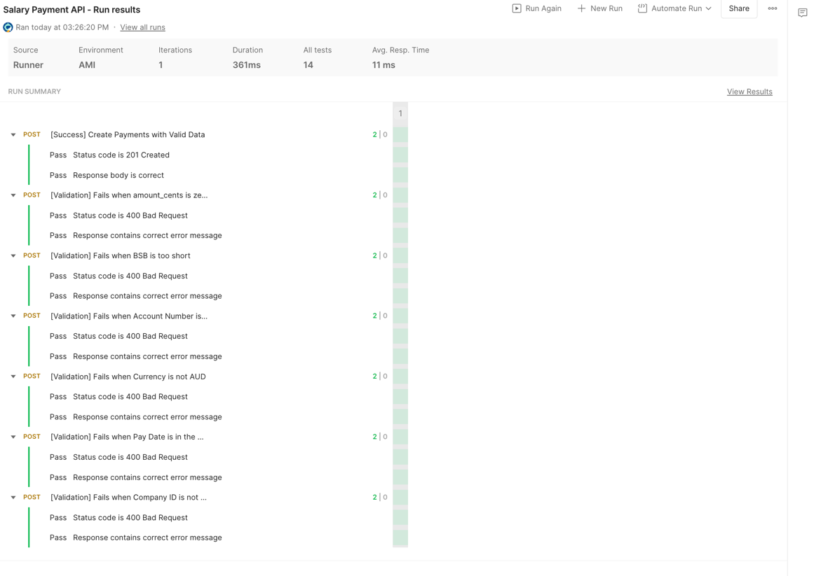

# Salary Payment File Exporter

[](https://github.com/LyTuan/salary-payment-file-exporter/actions)

This is a Ruby on Rails API application designed to accept salary payment information, store it, and export it daily as a formatted text file.

---

## 📦 Tech Stack

*   **Ruby:** 3.3.4
*   **Rails:** 8.0 (API Mode)
*   **Database:** PostgreSQL (managed via Docker)
*   **Testing:** RSpec, FactoryBot, Shoulda-Matchers
*   **Containerization:** Docker & Docker Compose

---

## 🏛️ Project Structure

The project follows standard Ruby on Rails conventions, with a few key directories for our specific logic:

*   **/app/controllers**: Handles incoming HTTP requests.
    *   `payments_controller.rb`: Manages the creation of new payments via the API.
*   **/app/models**: Contains the application's data models and their validations.
    *   `payment.rb`: The core model for a single payment record.
    *   `company.rb`: Represents a company making payments.
    *   `exported_file.rb`: Tracks the batch export files.
*   **/app/services**: Encapsulates specific business logic into plain Ruby objects.
    *   `payment_creator.rb`: Handles the logic for creating a batch of payments.
    *   `payment_exporter.rb`: Contains the logic for querying pending payments and generating the export file.
*   **/config**: Application configuration.
    *   `routes.rb`: Defines the API endpoints.
*   **/db**: Contains database schema, migrations, and seed data.
*   **/lib/tasks**: Custom Rake tasks.
    *   `exporter.rake`: The task to trigger the daily payment export.
*   **/spec**: All tests for the application.
    *   `/factories`: Blueprints for creating test data with FactoryBot.
    *   `/models`: Unit tests for models.
    *   `/requests`: Integration tests for the API endpoints.
    *   `/services`: Unit tests for the service objects.
*   **docker-compose.yml**: Defines the PostgreSQL database service for a consistent development environment.

---

## ⚙️ Prerequisites

Before you begin, ensure you have the following installed on your system:

*   [Ruby](https://www.ruby-lang.org/en/documentation/installation/) (version 3.3.4, preferably managed with a tool like `rbenv` or `asdf`)
*   Bundler
*   Docker
*   Docker Compose

---

## 🚀 Getting Started

Follow these steps to get your development environment set up and running.

### 1. Clone the Repository

```sh
git clone <your-repository-url>
cd salary-payment-file-exporter
```

### 2. Install Dependencies

Install the required Ruby gems using Bundler.

```sh
bundle install
```

### 3. Start the Database

This project uses Docker Compose to manage the PostgreSQL database. Start the database container in the background:

```sh
docker-compose up -d
```

### 4. Create and Set Up the Database

With the database container running, create, migrate, and seed your development and test databases.

```sh
# Create the databases
rails db:create

# Run migrations
rails db:migrate

# Seed the database with initial data (e.g., a default company)
rails db:seed
```

### 5. Run the Application

Start the Rails server. By default, it will run on `http://localhost:3000`.

```sh
rails server
```

---

## ✅ How to Run the Test Suite

This project uses RSpec for testing.

1.  **Prepare the Test Database:**
    Ensure your test database schema is up to date.
    ```sh
    rails db:test:prepare
    ```

2.  **Run All Tests:**
    Execute the entire test suite with the following command:
    ```sh
    bundle exec rspec
    ```
3. **Result**

    
---

## 💅 Linting and Code Style

This project uses [RuboCop](https://rubocop.org/) with the `rubocop-rails-omakase` configuration to enforce a consistent and high-quality coding style.

### Check for Offenses

To scan the entire project for style violations, run the following command:

```sh 
 bundle exec rubocop
```

To apply the code following rubocop detection, run the following command:
```sh
bundle exec rubocop -A 
```
---
## 🛡️ Security Scanning

This project uses [Trivy](https://github.com/aquasecurity/trivy) for security scanning, integrated directly into the GitHub Actions CI pipeline.

### Automated Scans

A Trivy scan is automatically performed on every pull request against the `main` branch. The scan checks for known vulnerabilities in both the operating system packages and the application's library dependencies (gems).

The CI build will fail if any vulnerabilities with a `HIGH` or `CRITICAL` severity are detected, ensuring that security issues are addressed before they are merged into the main codebase.

---
## ⚡️ Performance Testing

To ensure the application can handle a large volume of data, especially for the daily export job, performance testing tasks are included.

### 1. Seed Performance Data

First, populate the database with a large number of pending payments using the provided Rake task. You can specify the number of records to create using the `COUNT` environment variable.

```sh
# Example: Seed the database with 1,000,000 payment records
rails performance:seed COUNT=1000000
```

### 2. Run the Exporter Performance Test

Once the database is seeded, you can measure the performance of the export job. The `time` command will show the total execution time.

```sh
time bundle exec rails exporter:run
```

Monitor the memory and CPU usage of the process while it runs to identify potential bottlenecks.

### 3. Database Indexing for Performance

When working with large datasets, database indexes are critical for query performance. The `PaymentExporter` service relies on an efficient query to find pending payments.

To optimize this, we should add a composite index on the `status` and `pay_date` columns of the `payments` table.

**1. Generate the Migration:**

```sh
rails g migration AddIndexForExporterToPayments
```

**2. Edit the Migration File:**

Open the newly created migration file in `db/migrate/` and add the following code. Using the `concurrently` algorithm is essential for applying indexes to large tables in production without causing downtime.

```ruby
class AddIndexForExporterToPayments < ActiveRecord::Migration[8.0]
  disable_ddl_transaction!

  def change
    add_index :payments, [:status, :pay_date], algorithm: :concurrently
  end
end
```

**3. Apply the Migration:**

```sh
rails db:migrate
```

---

## 🌊 Workflows

Visual diagrams of the application's main processes, created with Mermaid.

### API Payment Creation Flow

This diagram illustrates the sequence of events when a client submits new payments to the `POST /payments` endpoint. It shows the authentication, validation, and creation process.



### Daily Batch Export Flow

This diagram shows the process of the daily batch job (`exporter:run`), which is responsible for generating the payment file. The process is designed to be memory-efficient and transactional.



---

## 🛠️ Usage

### API Endpoint: Create Payments

You can submit a batch of payments to the `POST /payments` endpoint.

**Example `curl` Request:**

```sh
curl -X POST http://localhost:3000/payments \
-H "Content-Type: application/json" \
-d '{
  "payment": {
    "company_id": 1,
    "payments": [
      {
        "employee_id": "E123",
        "bank_bsb": "062000",
        "bank_account": "12345678",
        "amount_cents": 500000,
        "currency": "AUD",
        "pay_date": "2024-10-28"
      },
      {
        "employee_id": "E456",
        "bank_bsb": "082000",
        "bank_account": "87654321",
        "amount_cents": 650000,
        "currency": "AUD",
        "pay_date": "2024-10-28"
      }
    ]
  }
}'
```
---
### Rake Task: Export Payments

To manually trigger the daily payment export job, run the following Rake task. This will query pending payments and generate a `.txt` file in the `/outbox` directory.

```sh
rails exporter:run
```

To automatic trigger using cronjob at 17:00 every day run the following command:
```sh
crontab - e 
```
Then add bellow command to file and change /path/to/folder to relative path of your project:
```sh 
00 17 * * * /bin/bash -l -c 'cd path/to/folder && rbenv exec bundle exec rails exporter:run >> log/cron.log 2>&1'
```
---
###  Testing with Postman 
A Postman collection is included in this repository to make it easy to test the API endpoints and validation rules.

#### 1.  Locate the Collection File:
-   The collection is located at /postman/salary-payment-file-exporter.json.

#### 2.  Import into Postman:
- Open the Postman desktop application.
- Click the Import button in the top-left corner.••Drag and drop the salary-payment-file-exporter.json file into the import window.
- Drag and drop the salary-payment-file-exporter.json file into the import window

#### 3.Run the Collection:
- The collection uses a variable {{baseUrl}} which defaults to http://localhost:3000. Ensure your Rails server is running.••Click the three dots (...) next to the imported collection name ("Salary Payment API") and select Run collection.••Click the Run Salary Payment API button to execute all predefined tests, including success cases and specific validation failures.
- Click the three dots (...) next to the imported collection name ("Salary Payment API") and select Run collection.
- Click the Run Salary Payment API button to execute all predefined tests, including success cases and specific validation failures.
#### 4. Result
